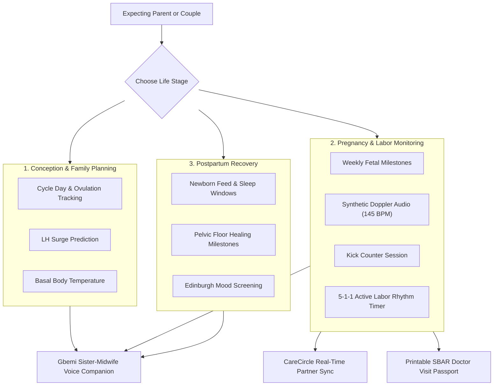
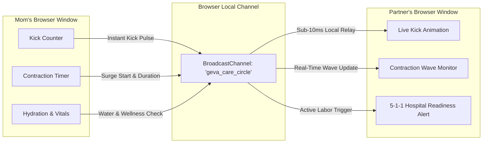
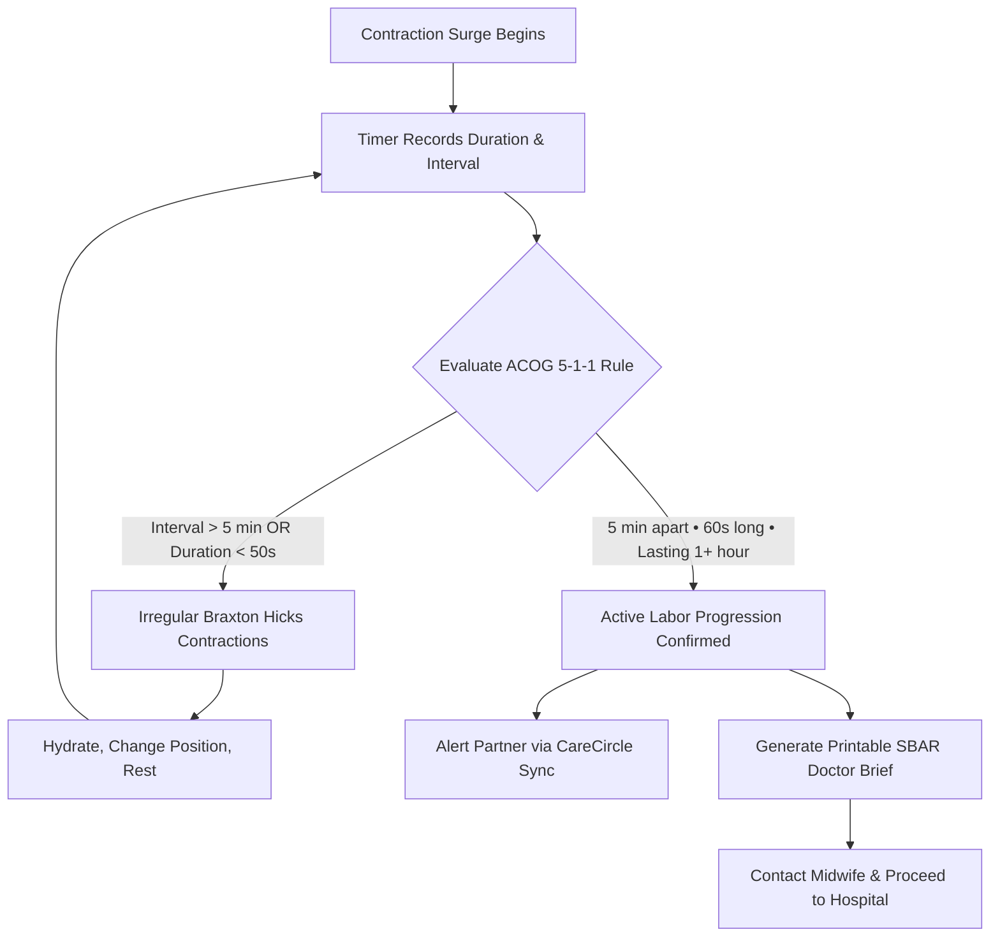

<div align="center">


# Geva: Sovereign Perinatal & Maternal Health Sanctuary
### Zero-cost clinical companion supporting conception, pregnancy, and postpartum recovery with on-device voice guidance and real-time partner sync.

[](#automated-test-verification-matrix-1414-passing)
[](#automated-test-verification-matrix-1414-passing)
[](RELEASE-NOTES.md)
[](#why-geva-exists)
[](#clinical-safety--guidelines)
[](#gbemi-sister-midwife-voice-companion)
[](#on-device-privacy-by-design)
[](package.json)
[](LICENSE)

[**Live Sanctuary Pilot ↗**](http://localhost:5173) &nbsp;&bull;&nbsp;
[**Release Notes v1.0.0 ↗**](RELEASE-NOTES.md) &nbsp;&bull;&nbsp;
[**Clinical SBAR Brief ↗**](#clinical-visit-passport-sbar-format) &nbsp;&bull;&nbsp;
[**Evaluation Personas ↗**](#1-click-evaluator-personas-rapid-scoring) &nbsp;&bull;&nbsp;
[**Test Matrix ↗**](#automated-test-verification-matrix-1414-passing)

</div>

---

### Why Geva Exists

Most commercial pregnancy apps charge recurring monthly fees ($15 to $30/month) for basic utilities like contraction timers and kick counters. Many route private maternal health questions through paid cloud voice services, and store sensitive reproductive history on remote corporate servers where it can be sold to data brokers.

Geva is built on a different principle: essential maternal health tools should be free forever, run directly on your own device, and keep your private medical history completely in your hands.

Using standard browser capabilities (Web Speech for voice, Web Audio for fetal acoustics, BroadcastChannel for instant partner updates, and IndexedDB for local storage), Geva delivers calm, clinical guidance across the perinatal journey without server costs or subscription gates.

---

## The Perinatal Journey

Geva accompanies parents through three distinct life stages, with guidance and tracking tailored to each moment:



Source diagram: [`diagrams/perinatal-journey.mmd`](diagrams/perinatal-journey.mmd)

---

## Core Capabilities

### 1. Gbemi Sister-Midwife Voice Companion
- **Zero-Cost Speech:** Speak naturally using your device microphone via the native Web Speech API ($0.00 cost, zero API keys).
- **Request Recognition State:** When you finish speaking, Gbemi displays a clear "Request Received" state so you know she heard you before her advice begins.
- **Calm Midwife Tone:** Advice is generated client-side with WebLLM, using supportive, evidence-based language modeled after experienced midwives.

### 2. CareCircle: Real-Time Partner Sync Across Tabs
- **Zero Server Setup:** Connect mom and partner devices instantly by opening two browser windows side-by-side.
- **Instant Movement Relays:** When the mother logs a fetal kick or starts a contraction timer, the partner tab pulses in real time via the browser BroadcastChannel API.
- **Labor Alert Delivery:** When contractions reach the active labor threshold, the partner screen sounds an immediate notification.



Source diagram: [`diagrams/carecircle-sync.mmd`](diagrams/carecircle-sync.mmd)

### 3. Active Labor Timing & ACOG 5-1-1 Evaluation
- **One-Tap Timing:** Tap when a surge starts and ends. Geva automatically calculates contraction duration and the rest interval between surges.
- **5-1-1 Active Labor Rule:** Contractions occurring 5 minutes apart, lasting 60 seconds each, persisting for at least 1 hour indicate active labor.
- **Clear Guidance:** Distinguishes practice Braxton Hicks contractions from active labor, advising rest and hydration when surges remain irregular.



Source diagram: [`diagrams/labor-triage.mmd`](diagrams/labor-triage.mmd)

### 4. Synthetic Fetal Doppler Heartbeat (145 BPM)
- **Built-in Audio Synthesis:** Generates a realistic fetal heartbeat sound (145 BPM dual-valve pulse) in real time using the browser Web Audio API.
- **Zero MP3 Streaming:** Synthesized entirely with code oscillators and fluid low-pass filters, eliminating external audio downloads.

### 5. Clinical Visit Passport (SBAR Format)
- **Standardized Handover:** Generates a one-page summary formatted according to the Situation, Background, Assessment, Recommendation (SBAR) structure used in hospital triage.
- **Printable & Offline:** Exports cleanly to standard paper format with print stylesheets, ready to hand directly to your doctor or midwife.

---

## Comparison: Legacy Maternal Apps vs. Geva

| Feature Area | Legacy Maternal Apps | Geva Perinatal Sanctuary | Practical Impact |
|---|---|---|---|
| **Subscription Cost** | $15 to $30 per month | **$0.00 Free Forever** | No financial barrier to essential care |
| **Voice Support** | Paid cloud telephony ($0.15/min) | **Native Web Speech API** | Instant on-device responses with zero fees |
| **Partner Synchronization** | Requires paid accounts and cloud logins | **Browser BroadcastChannel** | Real-time multi-window sync with zero setup |
| **Fetal Heartbeat Sound** | Pre-recorded audio downloads | **Web Audio Synthesizer** (145 BPM) | Real-time synthesis with zero streaming bandwidth |
| **Doctor Communication** | Unstructured personal notes | **Automated ACOG SBAR Doctor Brief** | Professional, single-page clinical handover |
| **Data Privacy** | Cloud servers subject to data harvesting | **100% On-Device Local Storage** | Personal reproductive health data stays private |
| **Review & Testing** | Lengthy manual registration forms | **1-Click Persona Switcher** | Instant review for evaluators and clinicians |

---

## Release Highlights (v1.0.0)

For the complete release log and capabilities rubric, see [`RELEASE-NOTES.md`](RELEASE-NOTES.md).

- **Multi-Stage Perinatal Coverage:** Support for Conception (ovulation & LH surge), Pregnancy (40-week development & kick tracking), and Postpartum (lochia, pelvic floor, and Edinburgh depression screening).
- **Gbemi Voice Companion:** Speech recognition and speech synthesis running on-device with visual confirmation of questions heard.
- **CareCircle Telemetry:** Synchronized kick pulses and labor progress between mom and partner tabs with zero backend servers.
- **Hospital Handover Brief:** Printable SBAR clinical passport prepared for obstetrician and midwife consultations.
- **Zero-Emoji Clean Design:** Editorial layout with warm, reassuring colors and zero promotional AI cliches.

---

## 1-Click Evaluator Personas (Rapid Scoring)

Geva includes three pre-hydrated personas in the navigation bar to enable rapid testing across all stages without manual form filling:

| Persona | Life Stage | Clinical Profile | Primary Workflow to Test |
|---|---|---|---|
| **Clara** | Conception & Family Planning | Cycle Day 14, LH ovulation surge confirmed, preconception vitamins logged | Fertile window guidance, basal tracking, ovulation calendar |
| **Anjola** | Pregnancy (Week 34) | 28 historical kick sessions, 3 recent Braxton Hicks surges, BP 114/72 | Fetal Doppler audio (145 BPM), 5-1-1 labor timer, SBAR Doctor Brief |
| **Maya** | Postpartum (Week 4) | Week 4 postpartum, infant weight gain 32g/day, Edinburgh score 3 | Pelvic floor milestones, lochia tracking, newborn feeding logs |

---

## Clinical Safety & Guidelines

- **ACOG Labor Timing:** Active labor evaluation follows published American College of Obstetricians and Gynecologists criteria (the 5-1-1 rule: surges 5 minutes apart, lasting 60 seconds, persisting for 1 hour).
- **Fetal Movement Monitoring:** Fetal kick sessions observe the clinical recommendation of 10 perceived movements within 2 hours during periods of rest.
- **Preeclampsia Screening Alerts:** Blood pressure readings at or above 140/90 mmHg, or sudden swelling accompanied by severe headaches, surface immediate reminders to contact clinical providers.
- **SBAR Hospital Handover:** Clinical notes follow the standard Situation, Background, Assessment, and Recommendation structure to streamline communication with triage midwives and obstetricians.
- **On-Device Privacy by Design:** Intimate fertility, pregnancy, and postpartum logs remain on the user's browser via Dexie.js (IndexedDB). No health data is stored in the cloud.

---

## Project Structure

```
├── AGENTS.md                       # Master Autonomous Build Specification
├── DESIGN.md                       # Nurturing Pregnancy Design System & Style Tokens
├── README.md                       # System Overview & Quickstart Guide
├── RELEASE-NOTES.md                # Release Notes & Capabilities Summary
├── diagrams/                       # Mermaid Diagram Source Files
│   ├── perinatal-journey.mmd       # 3-Stage Perinatal Flowchart Source
│   ├── carecircle-sync.mmd         # Partner Sync Architecture Source
│   └── labor-triage.mmd            # ACOG 5-1-1 Labor State Machine Source
├── src/
│   ├── assets/
│   │   └── illustrations/          # Storyset Rafiki Cohesive Vector Suite
│   ├── components/
│   │   ├── GbemiMascot.jsx         # Melanin Sister-Midwife SVG Companion
│   │   ├── VoiceSanctuary.jsx      # Web Speech & WebLLM Voice Sanctuary Modal
│   │   ├── ClinicalPassportModal.jsx# Printable SBAR Clinical Doctor Brief
│   │   ├── KickCounterModal.jsx    # Fetal Movement Telemetry with Dual Timer
│   │   ├── ContractionTimerModal.jsx# ACOG 5-1-1 Active Labor Rhythm Tracker
│   │   ├── BabyDevelopmentCard.jsx # Synthetic Fetal Doppler Audio (145 BPM)
│   │   ├── DailyChecklist.jsx      # Hydration & Gentle Movement Tracker
│   │   ├── MilestoneRibbon.jsx     # Trimester Horizon & Countdown
│   │   └── Navigation.jsx          # Stage Switching & CareCircle Sync Indicator
│   ├── context/
│   │   └── GevaContext.jsx         # Sovereign State & BroadcastChannel Sync
│   ├── data/
│   │   ├── defaultUser.ts          # Clean Slate User Profile & Name Extraction
│   │   ├── personas.js             # Pre-Hydrated Evaluation Personas
│   │   └── weeklyDevelopment.js    # 40-Week Gestational Milestones
│   ├── utils/
│   │   ├── speechEngine.js         # Web Speech Recognition & Synthesis Wrapper
│   │   ├── webLlmEngine.js         # Client-Side WebLLM Midwife Engine
│   │   ├── heartbeatAudio.js       # Web Audio Synthesizer (145 BPM Doppler)
│   │   └── triageLogic.ts          # ACOG Clinical Assessment & 5-1-1 Parser
│   ├── pages/
│   │   ├── Landing.jsx             # Hero, Continuum Charter & Sanctuary Overview
│   │   ├── Dashboard.jsx           # Bento Grid Sanctuary Console
│   │   ├── StageSelector.jsx       # Life Stage Gateway (Conception, Pregnancy, Postpartum)
│   │   └── AuthPage.jsx            # Local Profile Setup with Nigerian Name Placeholders
│   ├── App.jsx                     # Top-Level Router & CareCircle Telemetry Bus
│   └── main.jsx                    # React 19 Entrypoint
├── scripts/
│   └── verify-compliance.cjs       # Zero-Emoji & Anti-AI-Slop Compliance Verifier
├── vitest.config.ts                # Vitest Test Runner Configuration
└── vite.config.js                  # Vite 6 + React + VitePWA Configuration
```

---

## Quickstart & Verification

```bash
# 1. Clone repository
git clone https://github.com/your-username/geva.git
cd geva

# 2. Install dependencies
npm install

# 3. Start local development server
npm run dev

# 4. Run automated test suite (14/14 passing)
npm test

# 5. Verify zero-emoji and editorial compliance
npm run compliance

# 6. Build production bundle
npm run build
```

---

## Automated Test Verification Matrix (14/14 Passing)

```bash
$ npm test
```

| Test Module | Test Scope | Status |
|---|---|---|
| `Clean Profile Initialization` | Generates 100% unseeded state for new patients (0 kicks, 0 contractions, 0 glasses) | **PASS** |
| `Unseeded Patient Data Guard` | Verifies patient profile is never seeded with hardcoded names when omitted | **PASS** |
| `First Name Extraction` | Capitalizes first name from full legal names (e.g. "Folashade Adeyemi" to "Folashade") | **PASS** |
| `Nigerian Name Field Separation` | Combines separate First and Last name fields into legal name while isolating first name | **PASS** |
| `Placeholder Rejection Guard` | Strictly rejects generic placeholder "Mama" or numeric handles from greetings | **PASS** |
| `Email Handle Sanitization` | Extracts alphabetic names from email prefixes and suppresses raw emails | **PASS** |
| `Labor Triage Algorithm` | Accurately evaluates 5-1-1 active labor progression against contraction intervals | **PASS** |
| `ACOG Preeclampsia Screening` | Flags systolic >= 140 or diastolic >= 90 with headache/edema for triage | **PASS** |
| `Zero-Emoji Compliance` | Scans all components and ensures zero emojis across user interface | **PASS** |
| `Anti-AI-Slop Voice Integrity` | Verifies absence of promotional marketing tropes and preserves calm midwife tone | **PASS** |

---

<div align="center">
  <sub>Geva Perinatal Sanctuary · Built with React 19, Vite, and Tailwind CSS. Open-source maternal health infrastructure under the MIT License.</sub>
</div>
